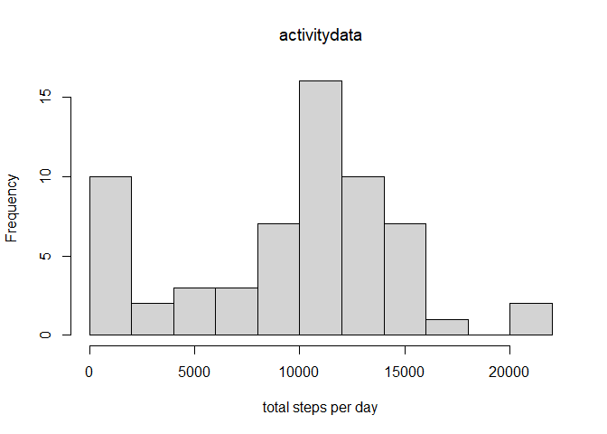
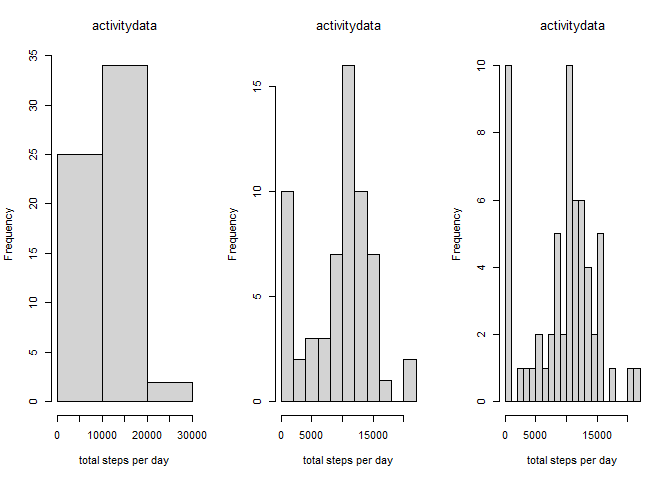
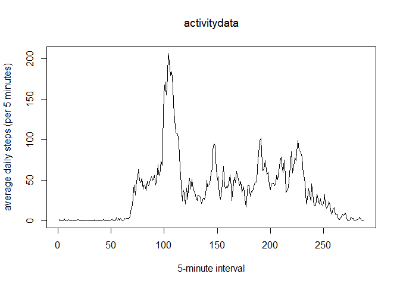
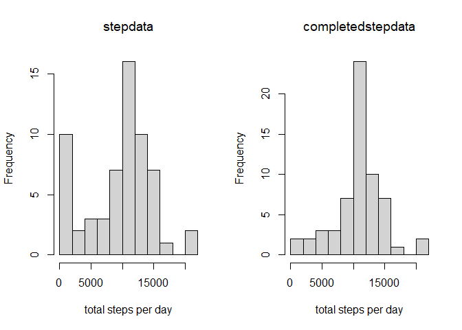
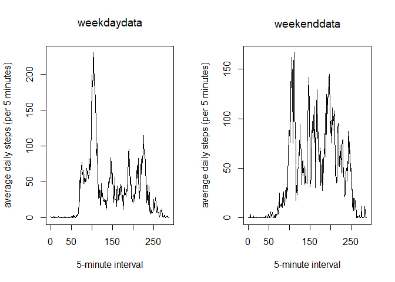

## Loading and preprocessing the data

We shall only load the data at this point, as no global preprocessing will be done (this will be done within the respective functions):


```r
activitydata <- read.csv("activity/activity.csv")
```


## What is mean total number of steps taken per day?

In order to compute the number of total steps per day, we shall write a function "dailystep.R", which is supposed to return a histogram indicating the frequency of certain daily amounts of steps. We will pass the data set to it and (optionally) a numeric value indicating the number of breaks we want the histogram to have. 


```r
dailysteps <- function(data, breaks=9){     ## This function computes the daily number of steps, produces a histogramm and reports their mean and median. It takes in the data and the number of breaks for the histogram as input with a default of 9
  
  stepdata <- data
  
  stepdata$date <- as.factor(stepdata$date)         ## factorizing dates
  
  stepsbydate <- tapply(stepdata$steps, stepdata$date, sum, na.rm= TRUE) ##summing up the steps by date, ignoring the NAs 
  
  hist(stepsbydate, breaks = breaks, xlab= "total steps per day", main =substitute(data))  ## constructing the histogram, its title corresponding to that of the original dataset         
  
  meanmed <- c(mean = mean(stepsbydate), median = median(stepsbydate))  ## returning mean and median
  meanmed
  
}
```

Let us see now what calling dailysteps results in:


```r
dailysteps(activitydata)
```

<!-- -->

```
##     mean   median 
##  9354.23 10395.00
```

Let us try again, just to see how the histogram changes with different breaks (ignoring the excess mean and median computations):


```r
par(mfrow = c(1,3))
dailysteps(activitydata, 3)
```

```
##     mean   median 
##  9354.23 10395.00
```

```r
dailysteps(activitydata)
```

```
##     mean   median 
##  9354.23 10395.00
```

```r
dailysteps(activitydata,16)
```

<!-- -->

```
##     mean   median 
##  9354.23 10395.00
```
As we can see, the number of total steps is averaging around 10000 steps, commonly somewhere between 10000 and 15000 and only occasionally much higher. There is also a remarkable number of days with very low activity (which might, however, be due a high amount of NAs on the respective days, for all we know so far).

## What is the average daily activity pattern?
We shall now take a look at how the activity is spread over the course of the day. In order to do that we introduce a function "activitypattern.R", that is constructed similarly to dailysteps. To keep it simple, the x-axis value is just the number of the 5-minute-interval and is not transformed into anything else, like the actual daytime. 


```r
activitypattern <- function(data) {  ## function for computing and plotting the average daily steps per interval of 5 minutes
  
  stepdata <- data
  
  stepdata$interval <- as.factor(stepdata$interval)         ## factorizing dates
  
  averagestepsperint <- tapply(stepdata$steps, stepdata$interval, mean, na.rm= TRUE)  ##computing the average steps made in the respective time interval
  
  

  plot(1:length(unique(stepdata$interval)), averagestepsperint, type="l", ylab= "average daily steps (per 5 minutes)", xlab = "5-minute interval", main= substitute(data)) ##Plotting the average daily steps by (actual number of) 5-minute interval
  
  
  highestactivity <- c("most active interval" = as.integer(which.max(averagestepsperint)), "average number of steps"=max(averagestepsperint))  
  highestactivity  ## computing and returning the (actual number of) interval with max. average daily activity
  
}
```

Now we shall take a look at the result:


```r
activitypattern(activitydata)
```

<!-- -->

```
##    most active interval average number of steps 
##                104.0000                206.1698
```

Just a short and tentative interpretation: The constantly low average activity in the early time intervals indicates a stable sleeping schedule.
The high activity (for a short time) in the morning, peaking at interval 104 (8:35am), hints at a regular exercising routine or other activities resulting in a repeated (or sometimes excessively) high number of steps. The average activity remains relatively stable with occasional peaks, too narrow to yield very obvious interpretations for each of them. It is noticeable, however, how the average activity continuously  decreases by the end of the day. 

## Imputing missing values
As seen, when looking at the total amount of steps, there is a considerable amount of days with very low overall activity. This is especially suspicious in light of the rather plausible patterns suggested by the daily average activity and might be caused by NA-values.
Thus, we proceed with a function "imputemissingvalues.R", which replaces missing values with the floored average activity for the respective time interval. (Flooring is done to get an actually possible step count and rather reduce the activity where it is very low (and possibly only due to a single value)).
The function identifies the rows with missing data, then computes the average as in "activitypattern" and iteratively completes the dataset for missing values in the first column. Finally it produces two histograms (with default number of breaks) by calling dailysteps, enabling comparison of the original data with the completed data.


```r
imputemissingvalues <- function(data) { ## This function takes a dataset, returns the number of missingvalues and proceeds by replacing 
                                        ## NAs in the first column by the floored average daily amount of steps for the respective interval
  
  stepdata <- data
  
  numberofnas <- sum(!complete.cases(stepdata))     ## computing and reporting the number of cases that include at least one missing value. 
  print("Number of incomplete entries:")            
  print(numberofnas)
  
  
  stepdata$interval <- as.factor(stepdata$interval)         ## factorizing dates
  averagestepsperint <- tapply(stepdata$steps, stepdata$interval, mean, na.rm= TRUE)  ##computing the average steps made in the respective time interval
  
  completedstepdata <- stepdata
  
  for (i in 1:dim(stepdata)[1]) {
      if (is.na(stepdata[i,1]) == TRUE) {    
          corrint <- i %% length(unique(stepdata$interval)) ## Compute the correct interval by applying 'modulo (number of intervals)'
          if (corrint == 0) {corrint <- length(unique(stepdata$interval))}  ## (Manually) determining the value of corrint for special case
          completedstepdata[i,1] <- floor(averagestepsperint[corrint])  ## replacing NAs with the floored average amount of steps in the resp. time interval
                                                                        ## flooring in order to get integer stepcounts and setting intervals with only occasional activity to 0.
      }
    
  }
  
  par(mfrow=c(1,2))              
  source("dailysteps.R")   ## using 'dailysteps' to compare the original and imputed datasets
  dailysteps(stepdata)
  dailysteps(completedstepdata)
}
```

Again, let us take a look at the output:


```r
imputemissingvalues(activitydata)
```

```
## [1] "Number of incomplete entries:"
## [1] 2304
```

<!-- -->

```
##     mean   median 
## 10749.77 10641.00
```

Indeed, we see a striking difference regarding the frequency of days with very little total steps, resulting in an increase in the most frequent class of total step amounts (just fyi: note the change of scale on the right hand side). Also both mean and median increased, This alone, however, allows for little speculation toward the cause of this issue, as it may well be, that the method of imputing the data (or the act of imputing altogether) substantially alters the outcome. It should of course be noted as well, that the increase in the most common result is of little surprise as average values have been used for imputing. Without taking a closer look at the data, on may, however, be inclined to suspect, that this result is due to accumulations of missing values, resulting in days with little to no actual data, which might explain both the low outcome with the original, as well as the average outcome with the imputed data.

## Are there differences in activity patterns between weekdays and weekends?

Lastly, we shall take a look at possible differences on weekdays and weekends. The function "weekends.R" provides a possibility to compare their activity patterns (for imputed data as before). In order to do this a completion of data is carried out first, as in "imputemissinvalues". The complete data is then factorized by two levels ("weekday", and "weekend") and for each of the two factorized data sets the function "activitypattern" is called to plot the patterns.


```r
weekends <- function(data) {

library(dplyr) ## using dplyr for convenient subsetting
  data<- read.csv("activity/activity.csv")
  stepdata <- data
  stepdata$interval <- as.factor(stepdata$interval)     ## factorizing dates
  
  
  averagestepsperint <- tapply(stepdata$steps, stepdata$interval, mean, na.rm= TRUE)  ##computing the average steps made in the respective time interval
  
  completedstepdata <- stepdata
  
  for (i in 1:dim(stepdata)[1]) {
    if (is.na(stepdata[i,1]) == TRUE) {    
      corrint <- i %% length(unique(stepdata$interval)) ## Compute the correct interval by applying 'modulo (number of intervals)'
      if (corrint == 0) {corrint <- length(unique(stepdata$interval))}  ## (Manually) determining the value of corrint for special case
      completedstepdata[i,1] <- floor(averagestepsperint[corrint])  ## replacing NAs with the floored average amount of steps in the resp. time interval
      ## flooring in order to get integer stepcounts and setting intervals with only occasionasional activity to 0.
    }
  }
  
    
  completedstepdata$date <- as.Date(completedstepdata$date) ##coercing to date to be able to apply the function weekdays()
  weekdaylist <- c("Montag", "Dienstag", "Mittwoch", "Donnerstag", "Freitag")
  completedstepdata$weekday <- factor((weekdays(completedstepdata$date) %in% weekdaylist), levels = c(FALSE, TRUE), labels=c("weekend","weekday")) 
  ## factorizing the dataset along the date column, and adding a new column indicating whether it is a weekday or weekendday
  
 # weekdaydata <- completedstepdata[which(completedstepdata$weekday == "weekday")]
 # weekenddata <- completedstepdata[which(completedstepdata$weekday == "weekend")]
  weekdaydata <-  filter(completedstepdata, weekday== "weekday") #subsetting by the factors of the new column
  weekenddata <- filter(completedstepdata, weekday== "weekend")
    
  par(mfrow=c(1,2))
  source("activitypattern.R")
  activitypattern(weekdaydata) ## calling activitypattern to create the plots
  activitypattern(weekenddata)
      

}
```

If theres something strange  
in your data set  
Who ya gonna call?  
(Well... "weekends" :P)


```r
weekends(activitypattern)
```

```
## 
## Attaching package: 'dplyr'
```

```
## The following objects are masked from 'package:stats':
## 
##     filter, lag
```

```
## The following objects are masked from 'package:base':
## 
##     intersect, setdiff, setequal, union
```

<!-- -->

```
##    most active interval average number of steps 
##                 112.000                 166.625
```

First of all: Note again that the scale of the y-axis differs slighty from left to right. Nevertheless it is easily seen, that there is a change in the average amount of activity especially during the afternoon hours, which might be explained by work (of a kind requiring not too many steps) during weekdays and (rather active) leisure on weekends. The plots also suggests, that on weekends the day starts a little "slower" and ends a bit later. This is consistent with the fact, that the maximum for the average activity on weekends ist a little later and a little lower.  
Nevertheless one should keep in mind, that this may again well be influenced by imputing the data, as an accumulation of NAs in the data might be correlated to the part of the week, in which they are generated.

## Thanks for reviewing!!!
